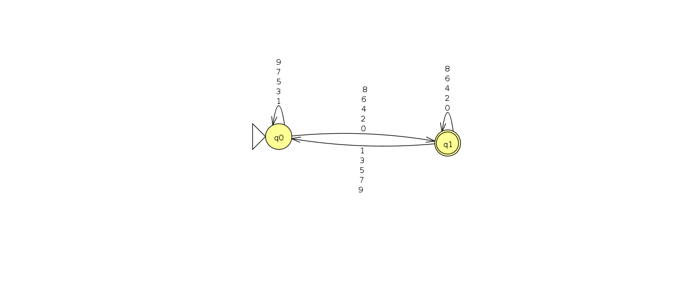
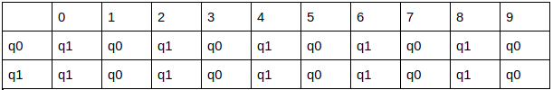
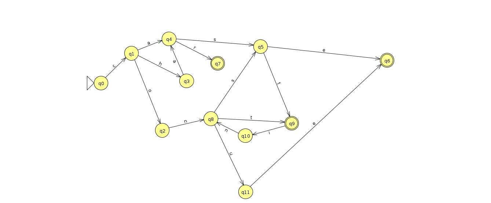

# Atividade02 da disciplina de Compiladores
# Semestre 2021.1

## Aluno:     Alysson Alexandre de Oliveira Araújo
## Matrícula: 474084
## Professor: João Marcelo

#
 

<br/>
<br/>

### Questão 01 - 0,5 Pontos

<br/>

### Escreva uma expressão regular que case cadeias de dígitos que representam números pares. Em seguida, construa um DFA equivalente à cadeia fornecida.

<br/>
<br/>

#### Resposta: 
#### digito = [0-9]
#### digitopar = 0|2|4|6|8
#### Expressão regular: ^digito* digitopar$

<br/>

#### Obs: quando usamos o '^' antes do conjunto, isto é, fora do conjunto, significa o inicio da palavra,número, ou algo do tipo, a ser formado, onde nesta questão ele diz que o inicío do número deve ser está presente em [0-9]. O símbolo '$' indica o final do número, palavra, ou algo do tipo, onde aqui obriga que a unidade final deste número seja par, ou seja, que esteja no conjunto digitopar.

<br/>

#### Fonte onde li sobre os símbolos usados nas expressões regulares: https://developer.mozilla.org/pt-BR/docs/Web/JavaScript/Guide/Regular_Expressions 

<br/>

#### Agora o DFA




#### O programa que eu uso, o JFLAP, ele não separa as coisas com vígulas, ele empilha todas as condições para que a leitura saia de um estado para outro. 
<br>

Detalhes do Autômato:
- Q = {q0,q1}
- Σ = {0,1,2,3,4,5,6,7,8,9}
- q0 = q0
- f{q1}
- δ ou tabela de transição de estados:



```
Correção: 0,2 pontos.

No conteúdo ministrado, o símbolo ^ tem outro significado. Ele é usado dentro do colchetes para indicar a negação de um conjunto.
Para descrever uma expressão regular para números pares, em compiladores, não precisamos nos preocupar com o início ou fim da linha. 
Por exemplo,

int a = 12;

Se eu quisesse capturar o número par como marca, o uso de ^ e $ iriam dificultar, visto que a linha termina com ; e começa com i. 
Sinceramente, não sei onde viu a necessidade de usar esses símbolos, pois não os mencionei em aula. 
Aí piora quando você informa o autômato, afinal como ele trataria ^ e $? Acaba que o autômato está correto, 
mas não corresponde à cadeia que você forneceu.
```


<br><br><br>

#
<br><br><br>

### Questão 02 - 0,5 Pontos
### Construa um DFA para aceitar as quatro palavras reservadas case, char, const e continue para a linguagem C.




Detalhes do Autômato:
- Q = {q0,q1,q2,q3,q4,q5,q6,q7,q8,q9,q10,q11}
- Σ = {a,c,e,h,i,n,o,s,t,u}
- q0 = q0
- f{q6,q7,q9}

  
<br><br><br>
#
<br><br><br>

```
Correção: 0,5 
Tudo Ok!
```


### Questão 03 - 0,5 Pontos
### Reescreva o pseudocódigo para a implementação do DFA para comentários em C (seção 2.3.3) utilizando o caractere de entrada como teste do case externo e o estado como teste do case interno. Compare seu pseudocódigo com o do texto. Quando seria preferível usar essa organização para o código que implementa um DFA?


``` 

estado := 1; {inicio}
while estado = 1, 2, 3 ou 4 do
    case caractere de entrada of 
    / : case estado of
        1: avance entrada;
            estado := 2;
        end case;
    * : case estado of
        2 : avance entrada;
            estado := 3;
        else estado := ... {erro ou outro} ;
        end case;
    * : case estado of
        3 : avance entrada;
            estado := 4;
        else avance entrada {continua no estado 3}
        end case;
    / : case estado of
        4 : avance entrada;
            estado := 5;
        * : avance entrada; {continha no estado 4}
        else avance entrada;
            estado := 3;
    defealt case:
        break while;
    end case;
end while;
if Automatos Finitos estado = 5 then aceitacao else erro; 

```

<br>

**Quando seria preferível usar essa organização para o código que implementa um DFA?**
<br>

Quando estamos buscando uma verificação mais rápida do código para saber se estamos tratando um comentário ou não, já que primeiramente vamos ler se o caractere de entrada atual é '/' e aí é que iremos entrar no case dos estados do DFA para ler os outros caracteres a seguir. Isso evitaria verificações desnecessárias, já que no código da seção 2.3.3 vai fazer a verificação diversas vezes dentro do while para veririfcar se estamos lidando com comentários.


```
estado := 1; {inicio}
while estado = 1, 2, 3 ou 4 do
    case estado of
    1: case caractere de entrada of
        / : avance entrada;
            estado := 2;
        end case;
    2: case caractere de entrada of
        * : avance entrada;
            estado := 3;
        else estado := ... {erro ou outro} ;
        end case;
    3: case caractere de entrada of
        * : avance entrada;
            estado := 4;
        else avance entrada {continua no estado 3}
        end case;
    4: case caractere de entrada of
        / : avance entrada;
            estado := 5;
        * : avance entrada; {continha no estado 4}
        else avance entrada;
            estado := 3;
    end case;
end while;
if Automatos Finitos estado = 5 then aceitacao else erro; 
```

```
Correção: 0,5
Tudo Ok!
```
