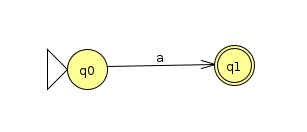
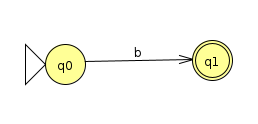
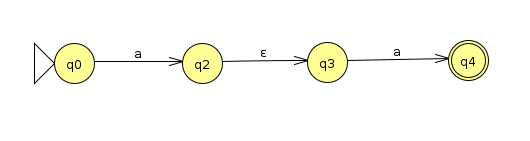
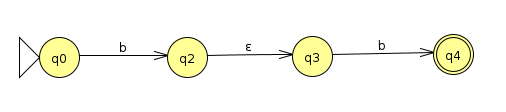
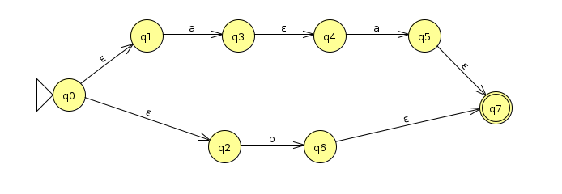
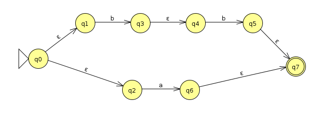
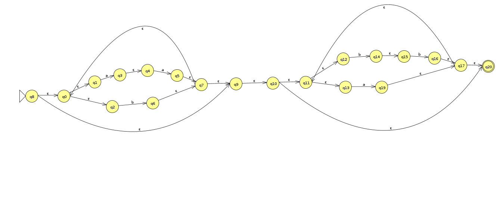
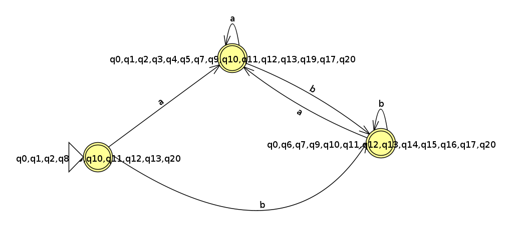

# Atividade03 da disciplina de Compiladores
# Semestre 2021.1

> Correção:
> 
> Questão 01: 1,0 Ponto.
> 
> Tudo OK. Algumas imprecisões, mas a explicação está no raciocínio correto, demonstra seu esforço.
> 
> Questão 02: 0,0 arquivo vazio.

## Aluno:     Alysson Alexandre de Oliveira Araújo
## Matrícula: 474084
## Professor: João Marcelo

#
 

 

 

### Questão 01 - 1,0 Ponto
 
 

1. Use a construção de Thompson para converter a expressão regular (aa|b)* (a|bb)* em um NFA. Aqui pessoal acho que explicação na aula ficou bem precisa, portanto quero que façam com os detalhes de cada construção intermediária.

     
     

    Como podemos ver, a expressão regular (aa|b)* (a|bb)* trabalha com as letras **a**, **b**. Neste ponto, primeiramente vamos construir ***Expressões regulares básicas*** de acordo com essa expressão regular e, em seguida, transfomar elas em NFA, onde essa é a primeira parte da construção de Thompson para converter essa expresão regular em um NFA. São essas as expressões regulares:
    - a
    - b
    - aa
    - bb
    
    Segue abaixo as formações das máquinas de cada expressão regular de acordo com sua NFA.
    - a

        

    - b  

         
         
         
            
            
            Agora vamos fazer a concatenação aa e bb:
    
     
    
    - aa  
        
        

    - bb
        
        

     
    
    Formamos, em seguida, a máquina para a escolha aa|b :

    

     
     
    
    E, agora, formamos a máquina para a escolha a|bb:

    

    Como podemos observar, a ER (aa|b)* (a|bb)* pode ocorrer repetição, então vamos construir uma máquina correspondente a (aa|b)* e (a|bb)*. Segue abaixo a construção:

     

    - (aa|b)*
    
    *.png)

     
     

    - (a|bb)*

    *.png)

     
     

    Para finalizar a construção de Thompson, onde estamos convertendo a expressão regular (aa|b)* (a|bb)* em um NFA, vamos concatenar o (aa|b)* com (a|bb)*, resultando no final da construção:

    

 
 

2. Converta o NFA anterior em um DFA usando a construção de subconjuntos. Como no próprio livro texto a explicação está informal, vocês podem ter liberdade ao explicar a resolução que apresentarem aqui, não precisa ser exatamente como fiz em aula, desde que adote os mesmos principios. Tente fazer e descreva aqui na forma mais conveniente como tentou resolver a questão. Em suma, não vale colocar apenas o resultado final do DFA. Também relembrando para não inserir fotografias de cadernos, utilize ferramentas digitais para facilitar a compreensão.

    

     

    Para converter o NFA da parte 1 desta questão pada DFA, vamos usar o ε-fecho de um conjunto de estados e construções de subconjuntos.
    
    A princípio, vamos considerar o NFA, da parte 1 da questão, abaixo como sendo M
     
    e a partir dele vamos construir o seu DFA -M.

    Seja, S' = Ø como o conjunto de estados de -M. Com isso, adicionamos a S' o estado inicial de -M como o ε-fecho do estado inicial de M. Logo:
    
    S = {q0,q1,q2,q3,q4,q5,q6,q7,q8,q9,q10,q11,q12,q13,q14,q15,q16,q17,q18,q19,q20}, onde S é o conjunto de estados de M e q8 é o estado inicial de M. 

    Dessa forma, podemos dizer como quais são os ε-fecho de q8, segundo o NFA M, são:

     
    

    -q8 = {q0,q1,q2,q8,q9,q10,q11,q12,q13,q20}
    
     
    

    Agora vamos fazer a união desse -q8 em S'da seginte forma: 
    
     
    
     
    S' = Ø U -q8 = {{q0,q1,q2,q8,q9,q10,q11,q12,q13,q20}}

     
    

    Prosseguindo, vamos agora criar o conjunto Sa' onde colocaremos os estados que são os destinos da transição de *a* de M. Analizando M, podemos dizer que são:
    
     
    

    Sa'={q3,q5,q19}

     
    

    Com o Sa', vamos agora pegar os ε-fechos das transições de *a*, onde teremos o -Sa' representando o conjunto dos ε-fechos,presente no conjunto Sa', dessa forma analizando o M, teremos:
    
     
    
    -Sa' = {q0,q1,q2,q3,q4,q5,q7,q9,q10,q11,q12,q13,q19,q17,q20}

     
    

    Agora, vamos pegar o -Sa' e vamos colocar no S', dessa forma teremos o S' assim:

     
    
    S' = S' U -Sa'
    
    S' = { {q0,q1,q2,q8,q9,q10,q11,q12,q13,q20}, 
     
    
    {q0,q1,q2,q3,q4,q5,q7,q9,q10,q11,q12,q13,q19,q17,q20}}

     
    

    Assim como fizemos com *a*, vamos fazer o mesmo com *b*. Vamos criar o conjunto Sb' onde colocaremos os estados que são os destinos da transição de *b* de M. Analizando M, podemos dizer que são:
    
     

    Sb' = {q6,q14,q16}

     

    Com o Sb', vamos agora pegar os ε-fechos das transições de *b*, onde teremos o -Sb' representando o conjunto dos ε-fechos, presente no conjunto Sa', dessa forma analizando o M, teremos:

     

    -Sb' = {q0,q6,q7,q9,q10,q11,q12,q13,q14,q15,q16,q17,q20}

     

    Agora, vamos pegar o -Sb' e vamos colocar no S', dessa forma teremos o S' assim:
    
     
    
    S' = S' U -Sb'
    
    S' = { {q0,q1,q2,q8,q9,q10,q11,q12,q13,q20},
     
    
    {q0,q1,q2,q3,q4,q5,q7,q9,q10,q11,q12,q13,q19,q17,q20}, 
    

    {q0,q6,q7,q9,q10,q11,q12,q13,q14,q15,q16,q17,q20} }

     
    
     

    A partir desse ponto, vamos criar o autômato DFA referente a S', que é a conversão do NFA M, baseado na expressão regular (aa|b)* (a|bb)* para o DFA -M. Seguindo abaixo vamos ter o -M:

     

    

    Para concluir a explicação e que ela seja bem simples, vamos dizer que os conjuntos 
    
    x = {q0,q1,q2,q8,q9,q10,q11,q12,q13,q20},
    
    
    y = {q0,q1,q2,q3,q4,q5,q7,q9,q10,q11,q12,q13,q19,q17,q20} e 
    
    z = {q0,q6,q7,q9,q10,q11,q12,q13,q14,q15,q16,q17,q20}
    
    são subconjuntos de S' no qual eles são os estados de -M.

    A princípio, todos os três estados são de aceitação, pois todos eles contém o estado q20, no qual é o estado de aceitação do NFA M no qual foi convertido para o DFA -M. Porém, o estado x é o único que tem o q8 presente nele, logo o mesmo será o estado inicial de -M.

    As transições foram feitas assim:
      - O -M sai do estado x para o estado y quando é feito uma leiuta da letra *a*, o motivo disso é que o estado q1, do NFA M, está presente no x e o estado q3, do NFA M, está presente no y, e como o estado q1 sai para o estado q3 quando lê a letra *a* no M, então vamos fazer uma ligação entre x e y.
      - O -M sai do estado x para o estado z quando é feito uma leiuta da letra *b*, o motivo disso é que os estados q2 e q12, do NFA M, está presente no x e os estados q6 e q14, do NFA M, está presente no z, e como os estados q2 e q12 saem para os estados q6 e q14, respectivamentes, quando lê a letra *b* no M, então vamos fazer uma ligação entre x e z.
      - Quando o -M estiver no estado y e ele ler um *a*, o seu estado irá permanecer no y, pois estados q4 e q13, do NFA M, saem para os estados q5 e q19, respectivamentes, quando leêm a letra *a*, e como esses estados estão presente em y, saída do estado, quando lê a letra *a*, vai para ele mesmo (y), já que os 4 estados estão presente nele. Enão vamos fazer uma ligação de y para y.
      - O -M sai do estado y para o estado z quando é feito uma leiuta da letra *b*, o motivo disso é que os estados q2 e q12, do NFA M, está presente no y e os estados q6 e q14, do NFA M, está presente no z, e como os estados q2 e q12 saem para os estados q6 e q14, respectivamentes, quando lê a letra *b* no M, então vamos fazer uma ligação entre y e z.
      - Quando o -M estiver no estado z e ele ler um *b*, o seu estado irá permanecer no z, pois o estado q15 , do NFA M, sai para o estado q16 quando lê a letra *b*, e como esses estados estão presente em z, saída do estado, quando lê a letra *b*, vai para ele mesmo (z), já que os 2 estados estão presente nele. Enão vamos fazer uma ligação de z para z.
      - O -M sai do estado z para o estado y quando é feito uma leiuta da letra *a*, o motivo disso é que o estado q13, do NFA M, está presente no z e o estado q19, do NFA M, está presente no y, e como os estados q13 sai para o estado q19 quando lê a letra *a* no M, então vamos fazer uma ligação entre z e y.

Está aí apresentado a transição do NFA M para o DFA -M.

