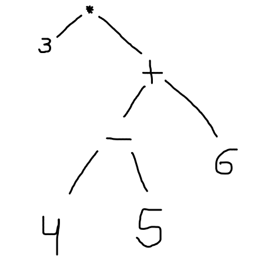

# Atividade04 da disciplina de Compiladores
# Semestre 2021.1

> Correção: 2,5 pontos
> 
> Tudo OK

## Aluno:     Alysson Alexandre de Oliveira Araújo
## Matrícula: 474084
## Professor: João Marcelo

#

 
 
 

### Questão 01 - 1,5 Pontos
Dada a gramática:

~~~~
exp -> exp soma termo | termo

soma -> +|-

termo -> termo mult fator | fator

mult -> *

fator -> (exp) | número
~~~~

Escreva derivações à esquerda, árvores de análise sintática e árvores abstratas para as expressões a seguir:

~~~~
1.   3 + 4 * 5 - 6
2.   3 * (4 - 5 + 6)
3.   3 - (4 + 5 * 6)
~~~~

 

Resposta da 1.1 :

 

~~~~

Analizando a gramática, vamos começar a derivação mais a esquerda com exp -> exp soma termo . 

A partir daqui vamos começar a derivação, com passo a passo. Logo após isso, será explicado cada passo da derivação de  3 + 4 * 5 - 6:

1. exp -> exp soma termo                              [exp -> exp soma termo]

2.     -> exp soma termo soma termo                   [exp -> exp soma termo]

3.     -> termo soma termo soma termo                 [exp -> termo]

4.     -> fator soma termo soma termo                 [termo -> fator]

5.     -> número soma termo soma termo                [fator -> número]

6.     -> número + termo soma termo                   [soma -> +]

7.     -> número + termo mult fator soma termo        [termo -> termo mult fator]

8.     -> número + fator mult fator soma termo        [termo -> fator]

9.     -> número + número mult fator soma termo       [fator -> número]

10.    -> número + número * fator soma termo          [mult -> *]

11.    -> número + número * número soma termo         [fator -> número]

12.    -> número + número * número - termo            [soma -> -]

13.    -> número + número * número - fator            [termo -> fator]

14.    -> número + número * número - número           [fator -> número]

Com a conclusão da derivação à esqueda, vamos construir uma arvore de análise sintática de 3 + 4 * 5 - 6, seguindo os passos da derivação feita de 3 + 4 * 5 - 6:

~~~~

 

~~~~
Para concluir, vamos agora para a árvore abstrata de 3 + 4 * 5 - 6:
~~~~

 

 
 
 

Resposta da 1.2 :

~~~~

Analizando a gramática, vamos começar a derivação mais a esquerda com exp -> termo

A partir daqui vamos começar a derivação, com passo a passo. Logo após isso, será explicado cada passo da derivação de 3 * (4 - 5 + 6):

1. exp -> termo                                                  [exp -> termo]

2.     -> termo mult fator                                       [termo -> termo mult fator]

3.     -> fator mult fator                                       [termo -> fator]

4.     -> número mult fator                                      [fator -> número]

5.     -> número * fator                                         [mult -> *]

6.     -> número * (exp)                                         [fator -> (exp)]

7.     -> número * (exp soma termo)                              [exp -> exp soma termo]

8.     -> número * (exp soma termo soma termo )                  [exp -> exp soma termo]

9.     -> número * (termo soma termo soma termo )                [exp -> termo]

10.     -> número * (fator soma termo soma termo )               [termo -> fator]

11.     -> número * (número soma termo soma termo )              [fator -> número]

12.     -> número * (número - termo soma termo )                 [soma -> -]

13.     -> número * (número - fator soma termo )                 [termo -> fator]

14.     -> número * (número - número soma termo )                [fator -> número]

15.     -> número * (número - número + termo )                   [soma -> +]

16.     -> número * (número - número + fator )                   [termo -> fator]

17.     -> número * (número - número + número )                  [fator -> número]

Com a conclusão da derivação à esqueda, vamos construir uma arvore de análise sintática de 3 * (4 - 5 + 6), seguindo os passos da derivação feita de 3 * (4 - 5 + 6):

~~~~

~~~~
Para concluir, vamos agora para a árvore abstrata de 3 * (4 - 5 + 6). Podemos usar como base a árvore sintática para construir ela. 
~~~~

 
 
 

Resposta da 1.3 :

~~~~

Analizando a gramática, vamos começar a derivação mais a esquerda com  exp -> exp soma termo

A partir daqui vamos começar a derivação, com passo a passo. Logo após isso, será explicado cada passo da derivação de 3 - (4 + 5 * 6):

1. exp -> exp soma termo                                                  [exp -> exp soma termo]

2.     -> termo soma termo                                                [exp -> termo]

3.     -> fator soma termo                                                [termo -> fator]

4.     -> número soma termo                                               [fator -> número]

5.     -> número - termo                                                  [soma -> -]

6.     -> número - fator                                                  [termo -> fator]
 
7.     -> número - (exp)                                                  [fator -> (exp)]

8.     -> número - (exp soma termo)                                       [exp -> exp soma termo]

9.     -> número - (termo soma termo)                                     [exp -> termo]

10.     -> número - (fator soma termo)                                    [termo -> fator]

11.     -> número - (número soma termo)                                   [fator -> número]

12.     -> número - (número + termo)                                      [soma -> +]

13.     -> número - (número + termo mult fator)                           [termo -> termo mult fator]

14.     -> número - (número + fator mult fator)                           [termo -> fator]

15.     -> número - (número + número mult fator)                          [fator -> número]

16.     -> número - (número + número * fator)                             [mult -> *]

17.     -> número - (número + número * número)                            [fator -> número]

Com a conclusão da derivação à esqueda, vamos construir uma arvore de análise sintática de 3 - (4 + 5 * 6), seguindo os passos da derivação feita de 3 - (4 + 5 * 6):

~~~~

~~~~
Para concluir, vamos agora para a árvore abstrata de 3 - (4 + 5 * 6). Podemos usar como base a árvore sintática para construir ela. 

~~~~

 
 
 

#

 
 
 

### Questão 02 - 1,0 Ponto

 

Dada a gramática:

~~~~
lexp -> átomo | lista

átomo -> número | identificador

lista -> (lexp-seq)

lexp-seq -> lexp-seq lexp | lexp
~~~~

1. Escreva derivações à esquerda e à direita para a cadeia (a 23 (m x y))
 
2. Desenhe uma árvore de análise sintática para a cadeia do item 1.

 
 
  

Resposta da 2.1: 

~~~~
    Para fazer a derivação mais a esquerda e outra derivação mais a direita de (a 23 (m x y)), vamos usar a gramática dita nesta questão.

    Primeiro, vamos fazer a derivação mais a esquerda de (a 23 (m x y)). Vamos começar com lexp. A partir dele, vamos transformá-lo em lista, pois como podemos ver, a cadeia possui parênteses e como lexp pode ir para lista, que se transforma em (lexp-seq), que possui parênteses, então vamos fazer isso.
    
     

1. lexp -> lista                                                                 [lexp -> lista]

2.      -> (lexp-seq)                                                            [lista -> (lexp-seq)]

3.      -> (lexp-seq lexp)                                                       [lexp-seq -> lexp-seq lexp]

4.      -> (lexp-seq lexp)                                                       [lexp-seq -> lexp-seq lexp]

5.      -> (lexp-seq lexp lexp)                                                  [lexp-seq -> lexp-seq lexp]

6.      -> (lexp lexp lexp)                                                      [lexp-seq -> lexp]

7.      -> (átomo lexp lexp)                                                     [lexp -> átomo]

8.      -> (identificador lexp lexp)                                             [átomo -> identificador]

9.      -> (identificador átomo lexp)                                            [lexp -> átomo]

10.      -> (identificador número lexp)                                          [átomo-> número]

11.      -> (identificador número lista)                                         [lexp-> lista]

12.      -> (identificador número (lexp-seq))                                    [lista-> (lexp-seq)]

13.      -> (identificador número (lexp-seq))                                    [lista-> (lexp-seq)]

14.      -> (identificador número (lexp-seq lexp))                               [lexp-seq -> lexp-seq lexp]

15.      -> (identificador número (lexp-seq lexp lexp))                          [lexp-seq -> lexp-seq lexp]

16.      -> (identificador número (lexp lexp lexp))                              [lexp-seq -> lexp]

17.      -> (identificador número (átomo lexp lexp))                             [lexp-> átomo]

18.      -> (identificador número (identificador lexp lexp))                     [átomo -> identificador]

19.      -> (identificador número (identificador átomo lexp))                    [lexp-> átomo]

20.      -> (identificador número (identificador identificador lexp))            [átomo-> identificador]

21.      -> (identificador número (identificador identificador átomo))           [lexp-> átomo] 

22.      -> (identificador número (identificador identificador identificador))   [átomo-> identificador] 

    A derivação mais a esquerda resultou em (identificador número (identificador identificador identificador)), encaixando com a cadeia (a 23 (m x y)) na questão dos seus tipos. Logo a derivação foi um sucesso.

    Agora vamos para a derivação mais a direita de (a 23 (m x y)).

    Primeiro, vamos fazer a derivação mais a direita de (a 23 (m x y)). Vamos começar com lexp. A partir dele, vamos transformá-lo em lista, pois como podemos ver, a cadeia possui parênteses e como lexp pode ir para lista, que se transforma em (lexp-seq), que possui parênteses, então vamos fazer isso. 
    *Passo inicial semenlhante com a que fizemos na derivação mais a esquerda.

    Começando:

1. lexp -> lista                                                                  [lexp -> lista]

2.      -> (lexp-seq)                                                             [lista -> (lexp-seq)]

3.      -> (lexp-seq lexp)                                                        [lexp-seq -> lexp-seq lexp]

4.      -> (lexp-seq lista)                                                       [lexp -> lista]

5.      -> (lexp-seq lista)                                                       [lexp -> lista]

6.      -> (lexp-seq (lexp-seq))                                                  [lista -> (lexp-seq)]

7.      -> (lexp-seq (lexp-seq lexp))                                             [lexp-seq -> lexp-seq lexp]

8.      -> (lexp-seq (lexp-seq átomo))                                            [lexp -> átomo ]

9.      -> (lexp-seq (lexp-seq identificador))                                    [átomo -> identificador ]

10.      -> (lexp-seq (lexp-seq lexp identificador))                              [lexp-seq -> lexp-seq lexp]

11.      -> (lexp-seq (lexp-seq átomo identificador))                             [lexp-> átomo ]

12.      -> (lexp-seq (lexp-seq identificador identificador))                     [átomo -> identificador ]

13.      -> (lexp-seq (lexp identificador identificador))                         [lexp-seq -> lexp ]

14.      -> (lexp-seq (átomo identificador identificador))                        [lexp -> átomo ]

15.      -> (lexp-seq (identificador identificador identificador))                [átomo -> identificador ]

16.      -> (lexp-seq lexp (identificador identificador identificador))           [lexp-seq  -> lexp-seq lexp ]

17.      -> (lexp-seq átomo (identificador identificador identificador))          [lexp -> átomo ]

18.      -> (lexp-seq número (identificador identificador identificador))         [átomo -> número]

19.      -> (lexp número (identificador identificador identificador))             [lexp-seq -> lexp]

20.      -> (átomo número (identificador identificador identificador))            [lexp -> átomo]

21.      -> (identificador número (identificador identificador identificador))    [átomo -> identificador]

A derivação mais a esquerda resultou em (identificador número (identificador identificador identificador)), encaixando com a cadeia (a 23 (m x y)) na questão dos seus tipos. Logo a derivação foi um sucesso.

~~~~

 
 

Resposta 2.2:

 
 

Para concluir, a construção dessa árvore abaixo mostra uma árvore de análise sintática com uma derivação mais a direita da cadeia (a 23 (m x y)):

