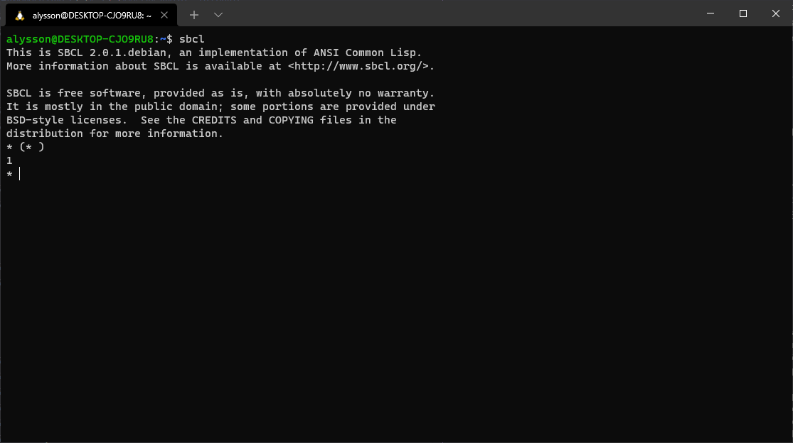
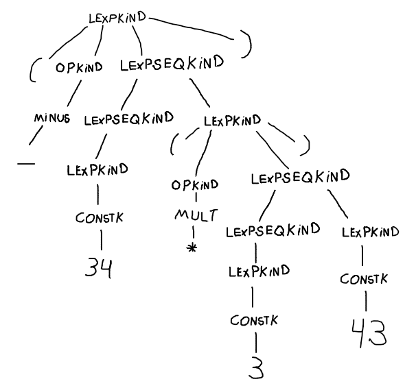

# Atividade05 da disciplina de Compiladores
# Semestre 2021.1


## Aluno:     Alysson Alexandre de Oliveira Araújo
## Matrícula: 474084
## Professor: João Marcelo

#


<br>
<br>
<br>

### Questão 01 - 3,0 Pontos

<h4>

Considere a gramática a seguir:

~~~~
lexp -> número | (op lexp-seq)
op -> +|-|*
lexp-seq -> lexp-seq lexp | lexp
~~~~

Essa gramática pode ser vista como uma representação de expressões aritméticas de inteiros simples em forma prefixa similar a linguagem LISP. Por exemplo, a expressão 34 -3 * 42 seria escrita nessa gramática como (- 34 (* 3 42)).

<br>

Responda às perguntas abaixo:


1. Que interpretação (valor) seria dada às expressões legais (- 2 3 4) e (- 2)? E às expressões (+ 2) e (* 2)?


2. Precedência e associatividade são problemas para essa gramática? A gramática é ambígua? Mostre alguns exemplos de derivações para expressões e discuta se é possível considerar duas escolhas de regras em algum momento.

3. Observando o exemplo da Figura 3.7 do livro texto, escreva declarações em C para uma estrutura de árvore sintática (abstrata) para a gramática. Novamente, é preciso entender as construções enum e struct em C para poder resolver esta questão.

4. Desenhe a árvore sintática para a expressão (- 34 (*3 43)), utilizando sua resposta para o item anterior.

</h4>


<br>
<br>

Resposta da 1.1:

Os valores dadas às expressões abaixo usando a linguagem LISP são:

* (- 2 3 4) resulta no valor -5, pois na linguagem LISP quando vamos avaliar essa expressão, o símbolo "-" denota uma função de subtração expressão ocorra a subtração entre 2 3 4 após o sinal de operação matemática, assim ocorre: 2-3-4 = -1-4 = -5.

* (- 2) resulta no valor -2, pois em LISP quando temos o símbolo "-" e apenas um elemento na expressão, no caso 2, ele aplica a negativação deste elemento, logo resulta em -2.

* (+ 2) resulta em 2, pois como não nenhum outro elemento na expressão, no caso 2, ele soma o símbolo "+" chama a função de soma e soma 2+0, que resulta em 2. * Quando aplicamos (+ ) em lisp pelo sbcl, resulta em 0.


* (* 2) resulta em 2, pois quando a linguagem trabalha com o símbolo " * " e apenas um elemento após ele na expressão, é entendido que o 2 está multiplicando 1. Dessa forma temos 2 * 1 = 2. Podemos ver no SBLC que quando aplicamos essa função (* ), ele nos retorna 1.


<br>
<br>
<br>

Resposta da 1.2:


A Precedência e associatividade não são um problema para esta gramática, já que na estrutura da gramática, quando queremos inserir um novo operador op ele está presente entre parênteses na regra [lexp -> (op lexp-seq)], isso separa das outras operações, por exemplo a multiplicação nesta expressão (+ 2 (* 3 4)) tem ordem de precedência sendo a multiplicação a primeira operação a ocorrer, dessa forma as precedências estão organizadas entre parênteses. Na questão da associatividade dessa gramática se interliga com as precedências no sentido que ela trabalha com parênteses, assim aplicando uma organização de associatividade da gramática.

Agora, vamos considerar a seguintes exemplos das expressões (+ 2 (* 3 4)) e (+ 2 1 4) e vamos fazer derivações nelas usando a a gramática dita no enunciado da questão. Como a linguagem LISP usa a ideia de leitura mais a esquerda, as derivações abaixo serão mais a esquerda.

OBS: Primeiro tenho que ressaltar que quando estou [lexp -> 2] ou outros dos números que aparece, estou me reperindo a regra [lexp -> número]. Como ele faz a transição para um número, eu já coloquei o número presente na derivação.

~~~~


Derivação de (+ 2 (* 3 4)):
Vamos começar o com lexp -> (op lexp-seq)

1. lexp  -> (op lexp-seq)                        [lexp -> (op lexp-seq)] 
2.       -> (+ lexp-seq)                         [op -> +]
3.       -> (+ lexp-seq lexp)                    [lexp-seq -> lexp-seq lexp]
4.       -> (+ lexp lexp)                        [lexp-seq -> lexp]
5.       -> (+ 2 lexp)                           [lexp -> 34] 
6.       -> (+ 2 (op lexp-seq))                  [lexp -> (op lexp-seq)] 
7.       -> (+ 2 (* lexp-seq))                   [op -> +] 
8.       -> (+ 2 (* lexp-seq lexp))              [lexp-seq -> lexp-seq lexp]
9.       -> (+ 2 (* lexp lexp))                  [lexp-seq -> lexp]
10.      -> (+ 2 (* 3 lexp))                     [lexp -> 3]
11.      -> (+ 2 (* 3 4))                        [lexp -> 4]


~~~~

    
    
Como estamos trabalhando com uma gramática que faz a representação de expressões aritméticas de inteiros simples em forma prefixa similar a linguagem LISP, o operador matemático deve está sempre a esquerda da expressão. Além disso, como temos um número após o operador, não podemos escolher outra regra, por exemplo no passo 3 onde usamos a regra [lexp-seq -> lexp-seq lexp] não podemos usar a regra [lexp-seq -> lexp] e ir direto para [lexp -> (op lexp-sep)], já que isso faria com que o número 2 ficasse ausente na derivação, logo a derivação da expressão ficaria errada e, concluindo, que só há apenas um caminho alternativa para fazer a derivação. 


~~~~
Derivação de (+ 2 1 4):
Vamos começar o com lexp -> (op lexp-seq)


1. lexp  -> (op lexp-seq)                        [lexp -> (op lexp-seq)] 
2.       -> (+ lexp-seq)                         [op -> +]
3.       -> (+ lexp-seq lexp)                    [lexp-seq -> lexp-seq lexp]
4.       -> (+ lexp-seq lexp lexp)               [lexp-seq -> lexp-seq lexp]
5.       -> (+ lexp lexp lexp)                   [lexp-seq -> lexp]
6.       -> (+ 2 lexp lexp)                      [lexp -> 2]
7.       -> (+ 2 1 lexp)                         [lexp -> 1]
8.       -> (+ 2 1 4)                            [lexp -> 4]


~~~~

Como estamos trabalhando com uma gramática que faz a representação de expressões aritméticas de inteiros simples em forma prefixa similar a linguagem LISP, o operador matemático deve está sempre a esquerda da expressão. Além disso, como temos três número após o operador, não podemos escolher outra regra, por exemplo no passo 3 ou 4 onde usamos a regra [lexp-seq -> lexp-seq lexp] não podemos usar a regra [lexp-seq -> lexp] e ir direto para [lexp -> (op lexp-sep)], já que isso faria com que o número 2 ou/e 1 ficasse ausente na derivação, fora que não existe outro operador a não ser o "+" na expressão, ou usar a regra [lexp-seq -> lexp] e ir para [lexp -> número], pois isso acarretaria na ausência de algum número presente na expressão. Logo a derivação da expressão ficaria errada e, concluindo, que só há apenas um caminho alternativa para fazer a derivação. 

Dito isso podemos confirmar que a gramática não é ambígua.

<br>
<br>
<br>

Resposta 1.3 está presente no **arquivo q3.c**, mas o código dela pode ser encontrado logo abaixo:

```C
/*
lexp -> número | (op lexp-seq)
op -> +|-|*
lexp-seq -> lexp-seq lexp | lexp
*/

typedef enum
{
    Plus,  // Operador   +
    Minus, // Operador   -
    Mult   // Operador   *
} OpKind;

typedef enum
{
    OpK,     // um OpKind
    ConstK,  // um Número
    LexpSeqK // um LexpSeqKind
} LexpKind;

typedef enum
{
    LexpK // um LexpKind
} LexpSeqKind;


/* a estrutura de um nó da árvore. Nessa árvore podemos ter OpKind, LexpKind, LexpSeqKind e um Value que representa
os números. */
typedef struct streeNode
{
    OpKind op;
    LexpKind lexp;
    LexpSeqKind LexpSeq;
    int Value; // é a contante, no caso o número.
    struct streetnode *leftchild, *rightchild; 
} STreeNode;
typedef STreeNode *SyntaxTree;
```


<br>
<br>
<br>

Resposta 1.4: Segue o desenho da árvore sintática da expressão (- 34 (*3 43))


