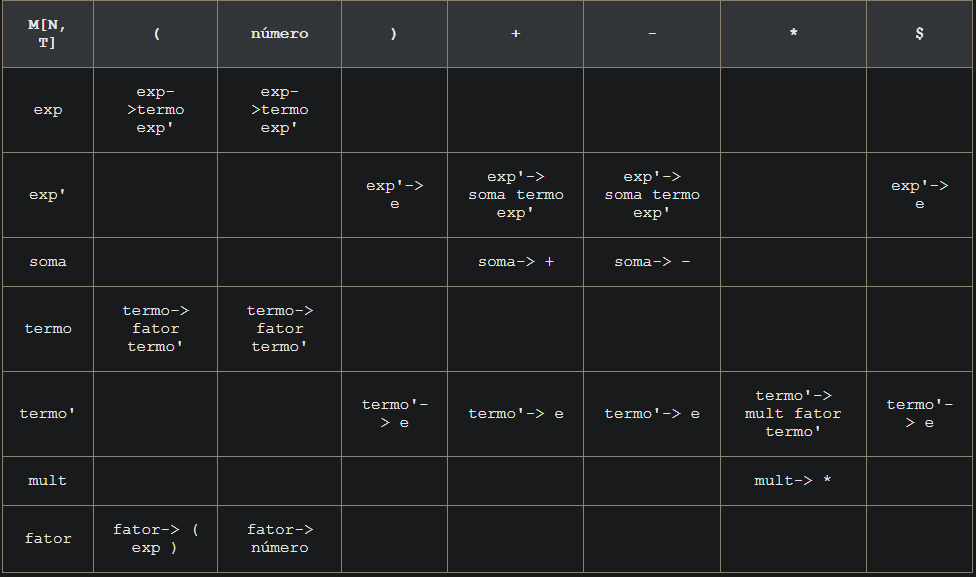
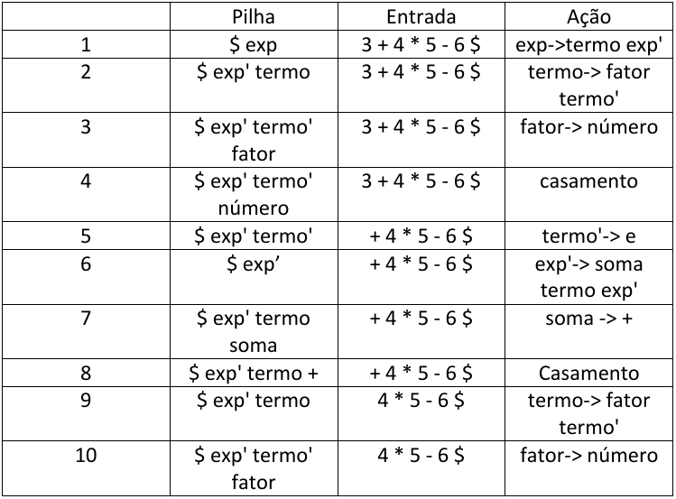
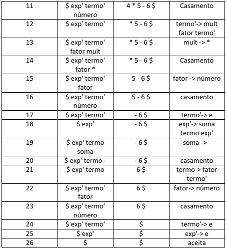
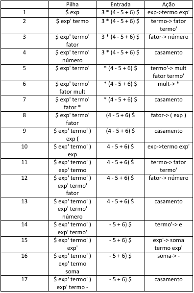
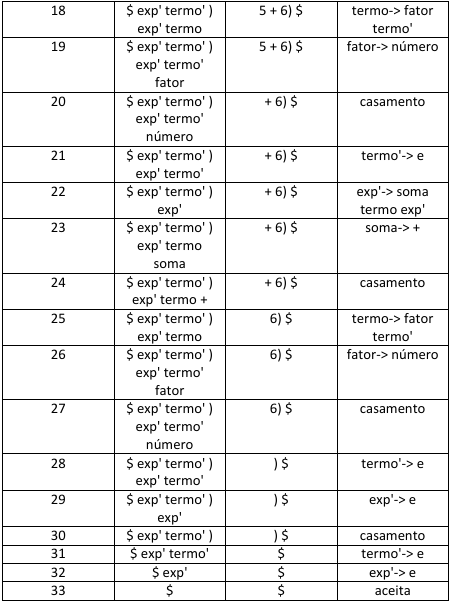
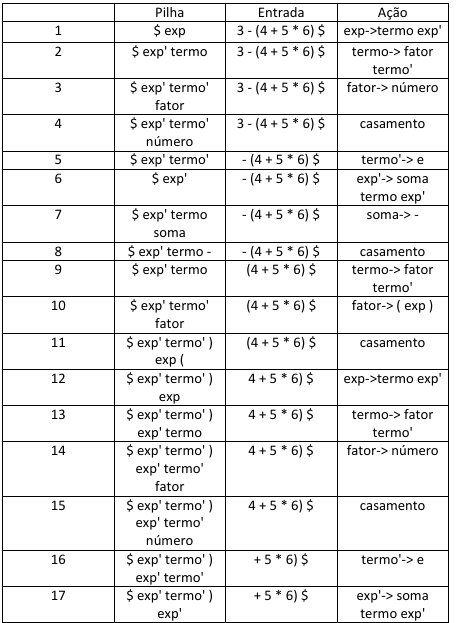
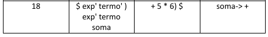
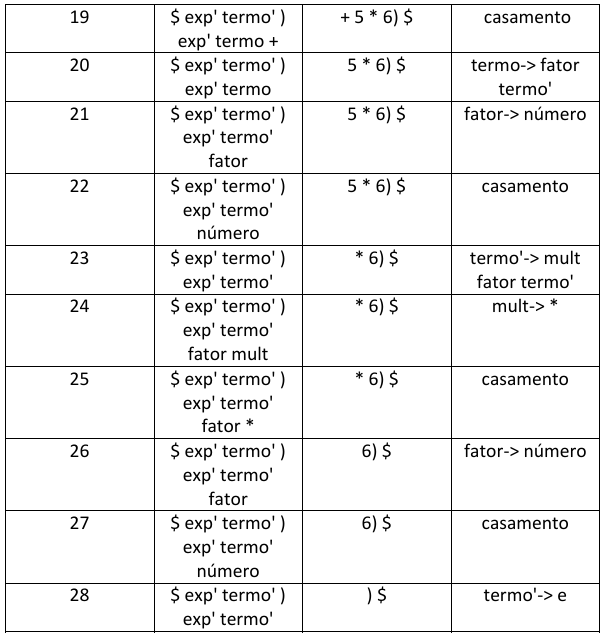
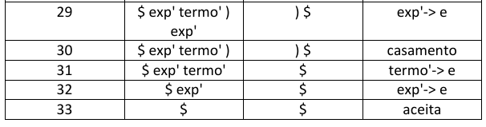

# Atividade07 da disciplina de Compiladores
# Semestre 2021.1

## Aluno:     Alysson Alexandre de Oliveira Araújo
## Matrícula: 474084
## Professor: João Marcelo

#

 
 
 

 
 
 
 
 
 

### Questão 01 - 1,5 Pontos

Mostre as ações (pilha, entrada e ações casamento ou geração) de um analisador LL(1) que utilize a Tabela 4.4 do livro texto para reconhecer as expressões aritméticas a seguir:

1. 3 + 4 * 5 - 6
2. 3 * (4 - 5 + 6)
3. 3 - (4 + 5 * 6)

Observação: abaixo a tabela, mas confiram no livro se realmente está igual.

 

 
 
 
 
 

**Resposta da  3 + 4 * 5 - 6**

 
 
 
 
 

**Resposta da  3 * (4 - 5 + 6)**

 
 
 
 
 

**Resposta da  3 - (4 + 5 * 6)**

