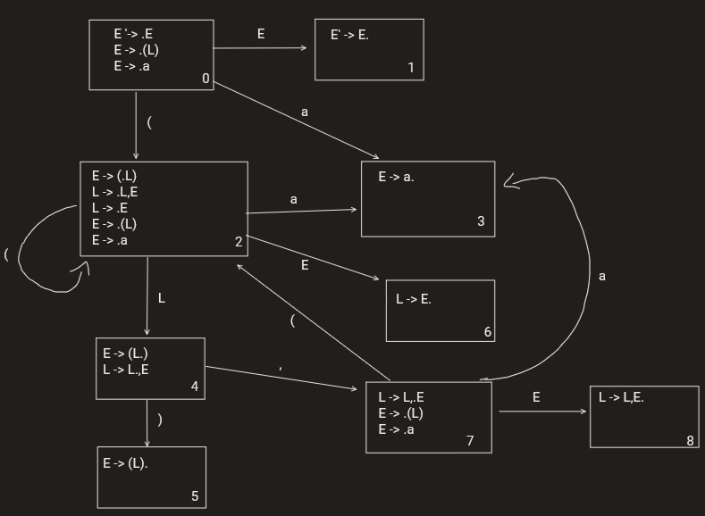

# Atividade09 da disciplina de Compiladores
# Semestre 2021.1

## Aluno:     Alysson Alexandre de Oliveira Araújo
## Matrícula: 474084
## Professor: João Marcelo

#

## Questão 01 - 1,0 Ponto
Considere a gramática a seguir:

~~~~
E -> (L) | a
L -> L,E | E
~~~~

1. Construa o DFA de itens LR(0) para essa gramática.
2. Mostre a pilha de análise sintática e as ações de um analisador LR(0) para a cadeia de entrada ((a),a,(a,a)). Se você encontrar algum conflito, indique sua natureza para explicar porque a derivação não prossegue.

**Reposta do 1.1:**  Construa o DFA de itens LR(0) para essa gramática.

 
 
 

A princípio vamos modificar essa gramática usando LR(0). Seguindo os conceitos de LR(0) vamos fazer produção de posições identificadas para adquirir a seguinte gramática:

~~~~
E' -> .E
E' -> E.
E -> .(L)
E -> (.L)
E -> (L.)
E -> (L).
E -> .a
E -> a.
L -> .L,E
L -> L.,E
L -> L,.E
L -> L,E.
L -> .E
L -> E.
~~~~

 
 

Após isso, vamos fazer um automato NFA no qual a sua conversão para DFA resulta em: 

 

DFA:

 
 
 

**Reposta do 1.2:** Mostre a pilha de análise sintática e as ações de um analisador LR(0) para a cadeia de entrada ((a),a,(a,a)). Se você encontrar algum conflito, indique sua natureza para explicar porque a derivação não prossegue.

Usaremos a gramática com LR(0) construída anteriormente:

 

~~~~
E' -> .E
E' -> E.
E -> .(L)
E -> (.L)
E -> (L.)
E -> (L).
E -> .a
E -> a.
L -> .L,E
L -> L.,E
L -> L,.E
L -> L,E.
L -> .E
L -> E.
~~~~

 

<table style="width:100%">
  <tr>
    <th></th>
    <th>Pilha de Análise Sintática</th>
    <th>Entrada</th>
    <th>Ação</th>
  </tr>
  <tr>
    <td>1</td>
    <td>$ 0</td>
    <td>((a),a,(a,a))$</td>
    <td>carrega</td>
  </tr>
  <tr>
    <td>2</td>
    <td>$ 0 (2</td>
    <td>(a),a,(a,a))$</td>
    <td>carrega</td>
  </tr>
  <tr>
    <td>3</td>
    <td>$ 0 (2 (2</td>
    <td>a),a,(a,a))$</td>
    <td>carrega</td>
  </tr>
  <tr>
    <td>4</td>
    <td>$ 0 (2 (2 a3</td>
    <td>),a,(a,a))$</td>
    <td>reduz E -> a</td>
  </tr>
  <tr>
    <td>5</td>
    <td>$ 0 (2 (2 E6</td>
    <td>),a,(a,a))$</td>
    <td>reduz L -> E</td>
  </tr>
  <tr>
    <td>6</td>
    <td>$ 0 (2 (2 L4</td>
    <td>),a,(a,a))$</td>
    <td>carrega</td>
  </tr>
  <tr>
    <td>7</td>
    <td>$ 0 (2 (2 L4 )5</td>
    <td>,a,(a,a))$</td>
    <td>reduz E -> (L)</td>
  </tr>
  <tr>
    <td>8</td>
    <td>$ 0 (2 E6 </td>
    <td>,a,(a,a))$</td>
    <td>reduz L -> E</td>
  </tr>
  <tr>
    <td>9</td>
    <td>$ 0 (2 L4 </td>
    <td>,a,(a,a))$</td>
    <td>carrega</td>
  </tr>  
  <tr>
    <td>10</td>
    <td>$ 0 (2 L4 ,7 </td>
    <td>a,(a,a))$</td>
    <td>carrega</td>
  </tr>
  <tr>
    <td>11</td>
    <td>$ 0 (2 L4 ,7 a3 </td>
    <td>,(a,a))$</td>
    <td>reduz E -> a</td>
  </tr>
  <tr>
    <td>12</td>
    <td>$ 0 (2 L4 ,7 E8******* </td>
    <td>,(a,a))$</td>
    <td>reduz L -> L,E</td>
  </tr>
  <tr>
    <td>13</td>
    <td>$ 0 (2 L4</td>
    <td>,(a,a))$</td>
    <td>carrega</td>
  </tr>
  <tr>
    <td>14</td>
    <td>$ 0 (2 L4 ,7</td>
    <td>(a,a))$</td>
    <td>carrega</td>
  </tr>
  <tr>
    <td>15</td>
    <td>$ 0 (2 L4 ,7 (2</td>
    <td>a,a))$</td>
    <td>carrega</td>
  </tr>
   <tr>
    <td>16</td>
    <td>$ 0 (2 L4 ,7 (2 a3</td>
    <td>,a))$</td>
    <td>reduz E -> a</td>
  </tr>
   <tr>
    <td>17</td>
    <td>$ 0 (2 L4 ,7 (2 E6</td>
    <td>,a))$</td>
    <td>reduz L -> E</td>
  </tr>
  <tr>
    <td>18</td>
    <td>$ 0 (2 L4 ,7 (2 L4</td>
    <td>,a))$</td>
    <td>carrega</td>
  </tr>
  <tr>
    <td>19</td>
    <td>$ 0 (2 L4 ,7 (2 L4 ,7</td>
    <td>a))$</td>
    <td>carrega</td>
  </tr>
  <tr>
    <td>20</td>
    <td>$ 0 (2 L4 ,7 (2 L4 ,7 a3</td>
    <td>))$</td>
    <td>reduz E -> a</td>
  </tr>
  <tr>
    <td>21</td>
    <td>$ 0 (2 L4 ,7 (2 L4 ,7 E8</td>
    <td>))$</td>
    <td>reduz L -> L,E</td>
  </tr>
  <tr>
    <td>22</td>
    <td>$ 0 (2 L4 ,7 (2 L4</td>
    <td>))$</td>
    <td>carrega</td>
  </tr>
  <tr>
    <td>24</td>
    <td>$ 0 (2 L4 ,7 (2 L4 )5</td>
    <td>)$</td>
    <td>reduz E -> (L)</td>
  </tr>
  <tr>
    <td>23</td>
    <td>$ 0 (2 L4 ,7 E8</td>
    <td>)$</td>
    <td>reduz L -> L,E</td>
  </tr>
  <tr>
    <td>25</td>
    <td>$ 0 (2 L4</td>
    <td>)$</td>
    <td>carrega</td>
  </tr>
  <tr>
    <td>26</td>
    <td>$ 0 (2 L4 )5</td>
    <td>$</td>
    <td>reduz E -> (L)</td>
  </tr>
  <tr>
    <td>27</td>
    <td>$ 0 E1</td>
    <td>$</td>
    <td>ACEITA</td>
  </tr>
 

  

</table>
