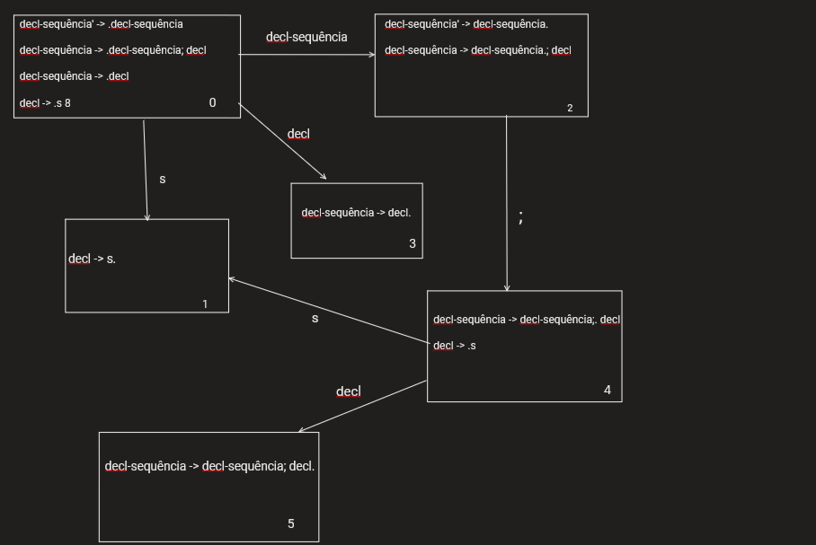
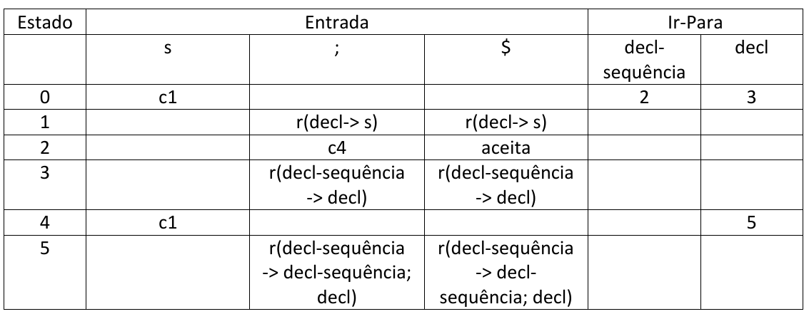

# Atividade10 da disciplina de Compiladores
# Semestre 2021.1

## Aluno:     Alysson Alexandre de Oliveira Araújo
## Matrícula: 474084
## Professor: João Marcelo

#

## Questão 01 - 2,0 Ponto

Questão 01 - 2,0 Pontos
Considere a gramática de sequências de declarações simplificadas a seguir:

~~~~
decl-sequência -> decl-sequência; decl | decl
decl -> s
~~~~

1. Construa o DFA de itens LR(0) para essa gramática.

2. Construa a tabela de análise sintática SLR(1).

3. Escreva a pilha de análise sintática e as ações para um analisador SLR(1) para a cadeia de entrada s;s;s.

4. Essa gramática é LR(0)? Se não for, identifique o conflito LR(0). Se for, construa a tabela de análise sintática LR(0), e explique como uma análise sintática pode diferir de uma análise SLR(1). Em outras palavras, explique como a análise SLR(1) pode funcionar para uma gramática mesmo que a LR(0) não funcione. Pode fornecer exemplos de gramáticas se desejar.

 
 
 

****

**Resposta 1.1**

Antes de construir a DFA, precisamos pegar a gramática mostrada no enunciado e aplicar o LR(0) que resulta na seguinte gramática:

 

~~~~
decl-sequência' -> .decl-sequência 
decl-sequência' -> decl-sequência. 
decl-sequência -> .decl-sequência; decl
decl-sequência -> decl-sequência.; decl 
decl-sequência -> decl-sequência;. decl 
decl-sequência -> decl-sequência; decl. 
decl-sequência -> .decl 
decl-sequência -> decl. 
decl -> .s 
decl -> s. 
~~~~

 

Agora que temos a gramática com LR(0), vamos fazer a construção da DFA:

 
 
 
 

****

**Resposta 1.2**

 
 
 

Os conjuntos de sequência para os não-terminais são:
- **Sequência(decl-sequência')={$}** e 

- **Sequência(decl-sequência)={$,;}**

A letra c indica uma ação de carregar e a letra r indica uma ação de redução.

Usamos a palavra "aceita" para (decl-sequência' -> decl-sequência) com entrada $.

 
 
 

****

**Resposta 1.3:**

 
 
 

Usaremos a gramática abaixo para a construção da pilha de análise sintática e as ações para um analisador SLR(1) para a cadeia de entrada s;s;s.

 
 
 

~~~~
decl-sequência' -> .decl-sequência 
decl-sequência' -> decl-sequência. 
decl-sequência -> .decl-sequência; decl
decl-sequência -> decl-sequência.; decl 
decl-sequência -> decl-sequência;. decl 
decl-sequência -> decl-sequência; decl. 
decl-sequência -> .decl 
decl-sequência -> decl. 
decl -> .s 
decl -> s. 
~~~~

 
 
 

Segue abaixo a tabela mostrando a pilha de análise sintática e as ações para um analisador SLR(1) para a cadeia de entrada s;s;s.

<table style="width:100%">
  <tr>
    <th></th>
    <th>Pilha de Análise Sintática</th>
    <th>Entrada</th>
    <th>Ação</th>
  </tr>
  <tr>
    <td>1</td>
    <td>$ 0 </td>
    <td>s;s;s$</td>
    <td>carrega 1</td>
  </tr>
  <tr>
    <td>2</td>
    <td>$ 0 s1 </td>
    <td>;s;s$</td>
    <td>r(decl->s)</td>
  </tr>
  <tr>
    <td>3</td>
    <td>$ 0 decl3 </td>
    <td>;s;s$</td>
    <td>r(decl-sequência->decl)</td>
  </tr>
  <tr>
    <td>4</td>
    <td>$ 0 decl-sequência2 </td>
    <td>;s;s$</td>
    <td>c4</td>
  </tr><tr>
    <td>5</td>
    <td>$ 0 decl-sequência2 ;4</td>
    <td>s;s$</td>
    <td>c1</td>
  </tr>
  <tr>
    <td>6</td>
    <td>$ 0 decl-sequência2 ;4 s1</td>
    <td>;s$</td>
    <td>r(decl->s)</td>
  </tr>
  <tr>
    <td>7</td>
    <td>$ 0 decl-sequência2 ;4 decl5</td>
    <td>;s$</td>
    <td>r(decl-sequência -> decl-sequência; decl)</td>
  </tr>
  <tr>
    <td>8</td>
    <td>$ 0 decl-sequência2 </td>
    <td>;s$</td>
    <td>c4</td>
  </tr>
  <tr>
    <td>9</td>
    <td>$ 0 decl-sequência2 ;4</td>
    <td>s$</td>
    <td>c1</td>
  </tr>
  <tr>
    <td>10</td>
    <td>$ 0 decl-sequência2 ;4 s1</td>
    <td>$</td>
    <td>r(decl->s)</td>
  </tr>
  <tr>
    <td>11</td>
    <td>$ 0 decl-sequência2 ;4 decl5</td>
    <td>$</td>
    <td>r(decl-sequência -> decl-sequência; decl)</td>
  </tr>
   <tr>
    <td>12</td>
    <td>$ 0 decl-sequência2 </td>
    <td>$</td>
    <td>aceita</td>
  </tr>

</table>

 
 
 
 

****

 
 

Enunciado da 1.4: 

<em> Essa gramática é LR(0)? Se não for, identifique o conflito LR(0). Se for, construa a tabela de análise sintática LR(0), e explique como uma análise sintática pode diferir de uma análise SLR(1). Em outras palavras, explique como a análise SLR(1) pode funcionar para uma gramática mesmo que a LR(0) não funcione. Pode fornecer exemplos de gramáticas se desejar.</em>

**Resposta 1.4:**

Não, essa gramática não é LR(0), pois os estados finais do autômato DFA construído da questão 1.1, onde no estado 2 dessa DFA temos item completo **decl-sequência' ->  decl-sequência** e com isso não devia ter nenhum item alé dele. Nesse caso, temos o outro item além do **decl-sequência' ->  decl-sequência** no estado 2, que é o **decl-sequência -> decl-sequência.; decl** e, além disso, temos a situação que esse item é de carregar, onde nele o **;** é um terminal, acaba ocorrendo uma ambiguidade em relação à execução das ações do (1) ou do (2). Essa situação se chama conflito carrega-reduz.

 
 
 
 

