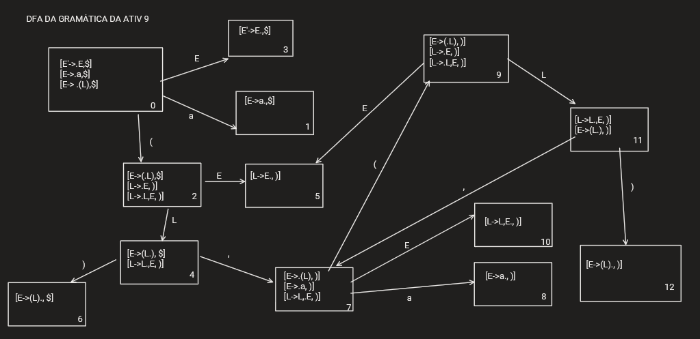
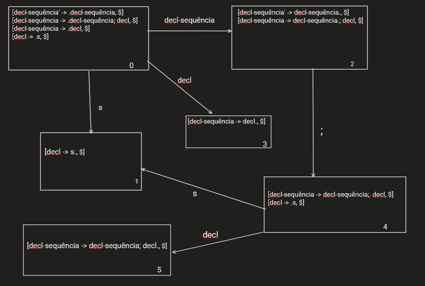
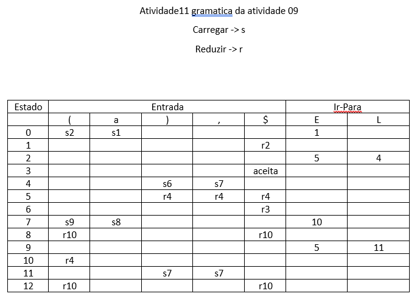
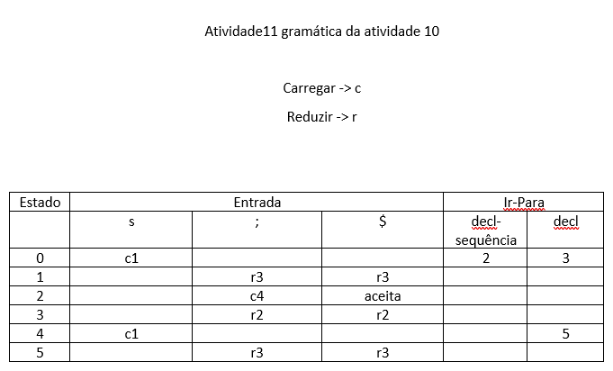
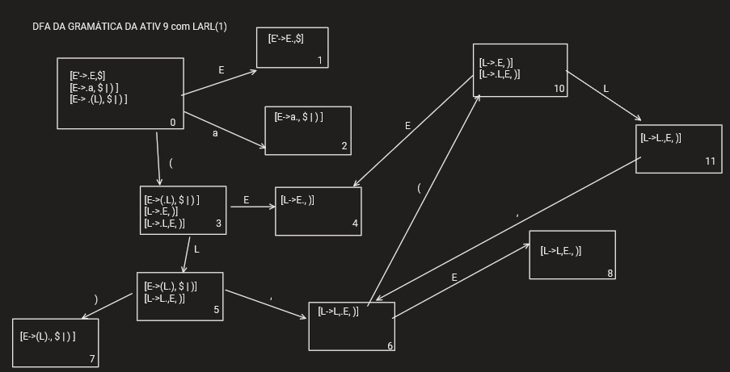
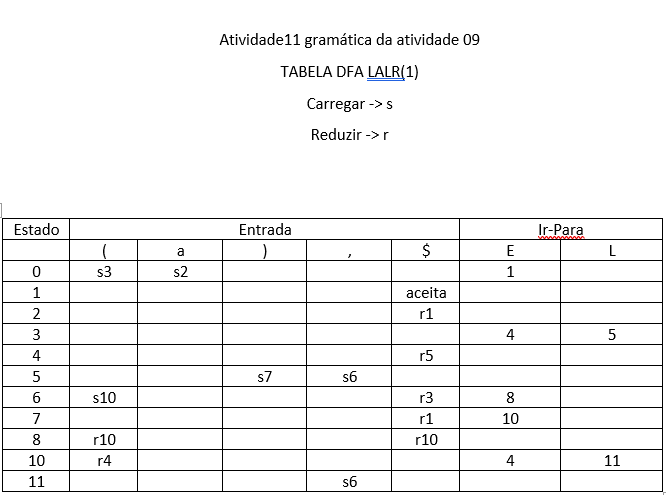

# Atividade11 da disciplina de Compiladores
# Semestre 2021.1

## Aluno:     Alysson Alexandre de Oliveira Araújo
## Matrícula: 474084
## Professor: João Marcelo

#

Questão 01 - 3,0 Pontos
Para as gramáticas das atividades 09 e 10, realize os seguintes passos:

1. Construa o DFA de itens LR(1) para a gramática.

2. Construa a tabela de análise LR(1) geral.

3. Construa o DFA de itens LALR(1) para a gramática.

4. Construa a tabela de análise sintática LALR(1).

5. Descreva as diferenças que podem ocorrer entre as ações de um analisador LR(1) geral e um analisador LALR(1).

 
 
 
 

Resposta 1.1:

DFA de itens LR(1) para a gramática da atividade 09 abaixo:

~~~~
E' -> .E
E' -> E.
E -> .(L)
E -> (.L)
E -> (L.)
E -> (L).
E -> .a
E -> a.
L -> .L,E
L -> L.,E
L -> L,.E
L -> L,E.
L -> .E
L -> E.
~~~~

DFA:

 
 
 

DFA de itens LR(1) para a gramática da atividade 10 abaixo:

~~~~
decl-sequência -> decl-sequência; decl | decl
decl -> s
~~~~

DFA:

 
 
 
 

Resposta 1.2:

 
 
 

Análise do DFA LR(1) da gramática da atividade 09:

 
 
 

Análise do DFA LR(1) da gramática da atividade 10:

 
 
 
 

Resposta 1.3:

 
 
 
 

DFA LALR(1) referente ao DFA LR(1) da gramática da atividade 09:

 
 
 
 

DFA LALR(1) referente ao DFA LR(1) da gramática da atividade 09:

**Como não temos outra marca além do $ no LR(1), então o DFA LALR(1) é o mesmo do DFA LR(1)**

 
 
 

Resposta 1.4:

 
 
 
 

LALR(1) da gramática da atividade 09

 
 

LALR(1) da gramática da atividade 10

 
 
 
 

Resposta da 1.5:

 
 

* Quando aplicamos o LR(1) em alguma gramática LR(0), pode ser que haja altereações no DFA dessa gramática, no sentido dos itens presentes nos estados e pelo o aumento da quantidade de estados do DFA, já que o LR(1) utiliza o modelo de marcações onde dependendo da construção dos itens da DFA, pode ocorrer uma mudança entre qual marcação é o próximo, e isso faz aparecer itens com núcleos já presentes na DFA, porém com uma outra marca (uma verificação à frente).

* Porém com o LALR(1), faz a junção dos itens com o mesmo núcleo, porém com marcas diferentes. Essa ação pode fazer com o que o DFA perca um ou mais estados, além de fazer alterações nos itens presentes nos estados.
